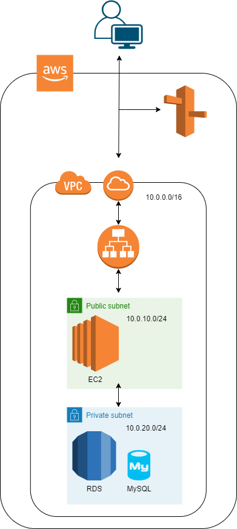

# 設計
## 業務フロー
#### ユーザー
* ログインする → ログイン後ホーム画面へ遷移
* ログアウトする → ログイン前ホーム画面へ遷移

* 日記ボタンを押す → 日記投稿ページへ遷移
* 日記を書き込み、スタンプを選ぶ → スタンプによってキャラクターの表情が変わる

* 日記閲覧ボタンを押す → 日記閲覧ページへ遷移
* 編集ボタンを押す → 編集ページ(投稿ページとほぼ同じ)へ遷移
* 削除ボタンを押す → データベースから削除

* 時差投稿ボタンを押す → 以前投稿できなかった日の投稿をできる

* チャートボタンを押す → チャートページへ遷移する
* チャートの点を押す → 当時の日記ページに遷移する
## 画面遷移図
https://www.figma.com/design/oslG8QuctbXG5c01WIfMHa/オリプロ%E3%80%80画面遷移図?node-id=0-1&t=tSqyitwRLtuNUNyd-0
## ワイヤーフレーム
https://www.figma.com/design/pYyMoOUk6togTRpK8RdOpw/ワイヤーフレーム?node-id=0-1&t=D9JhOLmIBpE5phgc-0
## テーブル定義書
### users
|項目名|データ型|初期値|必須|主キー|
|:--|:--|:--|:--|:--|
|id|BIGINT||TRUE|TRUE|
|name|VARCHAR||TRUE||
|email|VARCHAR||TRUE||
|password|VARCHAR||TRUE||
|created_at|TIMESTAMP|CURRENT_TIMESTAMP|TRUE||
|updated_at|TIMESTAMP|CURRENT_TIMESTAMP|TRUE||
### journals
|項目名|データ型|初期値|必須|主キー|
|:--|:--|:--|:--|:--|
|id|BIGINT||TRUE|TRUE|
|content|VARCHAR||||
|stamp|VARCHAR||TRUE||
|created_at|TIMESTAMP|CURRENT_TIMESTAMP|TRUE||
|updated_at|TIMESTAMP|CURRENT_TIMESTAMP|TRUE||
## システム構成図
